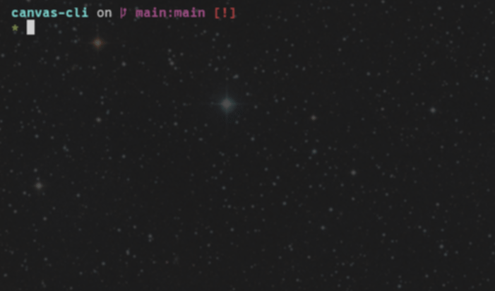

# Canvas CLI



Canvas CLI is a small program that retrieves information about your Canvas
account using only the terminal.

- Retrieves list of currently enrolled courses.
- Retrieves list of assignments for a particular course, color-coded and sorted
by due date.

## Dependencies

- `jq` - Command-line JSON parser.

`jq` is available on most Linux distributions. You can likely install it with
your distribution's package manager. For example, you would use the following
command on Debian or Ubuntu-based distributions (those that use `apt`):

```bash
$ sudo apt install jq
```

## Setup

To use the Canvas CLI program, simply clone the repository and echo your Canvas
API token into a `.env` file in the same directory.

```bash
$ git clone https://github.com/hazy-nate/canvas-cli
$ cd canvas-cli
$ echo "CANVAS_API_TOKEN=<TOKEN HERE>" > .env
$ canvas_cli ...
```

## Usage

```bash
Usage: canvas_cli <operation> [<class-id>]

Operations:
courses       Get the list of courses and their IDs.
assignments   Get the list of assignments for a particular
 course.
```

```bash
$ canvas_cli courses
31976   Virtual Workshop - Mandatory Internship Orientation
23404   Virtual Workshop - Resumes
...
```

```bash
$ canvas_cli assignments 23404
[    No Dat]     (5.0pts)        Certificate Quiz
```

## API Endpoints

| API Endpoint | Data |
| ------------ | ---- |
| `/api/v1/users/self/courses?enrollment_state=active&per_page=100` | List of currently enrolled courses. |
| `/api/v1/courses/<course-id>/assignments` | List of assignments for a course. |

### Note on pagination

Pagination isn't necessary for the first endpoint because, typically, students aren't enrolled in a substantial number of classes at once. With a page size of 100, the program should be able to retrieve all of the courses for someone.

## Reflection

I never realized that Canvas had an API you could interact with through programs. I always assumed that it was closed off. I learned how to generate a token on the Account page in Canvas and use it in an HTTP GET request. I was familiar with `jq` before this program was made, but I never knew it was so flexible.

If I had more time, I would make it so it was more interactive. Instead of typing two commands to get the course list and then the list of assignments, I would instead have it to where you could select the particular course with the arrow keys, and upon pressing enter have the list of assignments show up. I prefer interactive terminal user interfaces over entering commands any day.
